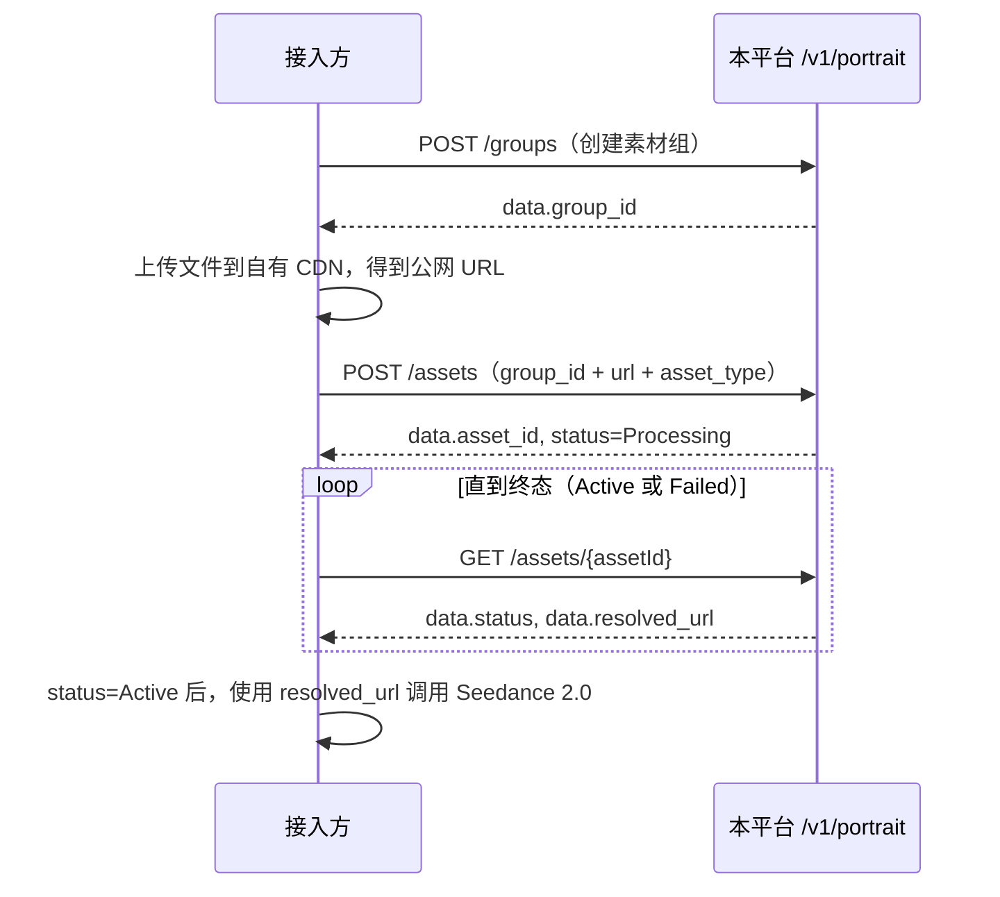

## 概述

本平台提供人像库 **HTTP REST 接口**，完成以下能力：

| 能力 | 说明 |
|------|------|
| 素材组管理 | 创建、查询、更新素材组；按**登录用户账号**隔离 |
| 素材管理 | 向指定素材组提交**公网 URL**（图片 / 视频 / 音频），查询状态，更新名称 |
| 状态同步 | 单条查询时**实时**刷新审核状态；后台另每 **5 分钟**轮询非终态素材 |

<Callout type="warn" title="重要限制（接入前必读）">
- **不提供文件上传**：平台**不代理** multipart 上传。须先将文件放到自有 OSS/CDN，再调用「创建素材」传入 **HTTPS 公网 URL**
- **数据隔离维度**：素材组、素材列表均按**用户账号**隔离，同账号下多把 Key 看到的数据相同
- **路径参数中的 ID**：路径参数 `:assetId` 为平台返回的 `asset_id`；`:groupId` 为平台返回的 `group_id`，**不是**本地自增字段 `id`
- **计费**：人像库接口本身不走 Relay 渠道计费
</Callout>

### Base URL

```text
https://api.mapi.zone/v1/portrait/...
```

---

## 接入准备

### 获取 API Token

在平台控制台创建 **API 令牌**，记下完整 Key（常见形态：`sk-xxxxxxxx`）。

### 请求头

所有接口均需携带：

| Header | 必填 | 说明 |
|--------|------|------|
| `Authorization` | 是 | `Bearer {token}` |
| `Content-Type` | POST / PUT 时建议 | `application/json` |

---

## 通用约定

### 统一响应结构

所有接口返回 **HTTP 200**，通过 `success` 字段区分成功 / 失败：

**成功：**

```json
{
  "success": true,
  "message": "",
  "data": { ... }
}
```

**失败：**

```json
{
  "success": false,
  "message": "人类可读的错误说明"
}
```

> HTTP 状态码始终为 `200`，业务错误通过 `success: false` + `message` 体现。`401` / `403` 由认证中间件在鉴权层返回。

### 分页参数（列表接口通用）

| Query 参数 | 类型 | 默认值 | 说明 |
|-----------|------|--------|------|
| `p` | integer | 1 | 页码，从 1 开始 |
| `page_size` | integer | 20 | 每页数量，最大 100 |

分页响应结构（`data` 字段内）：

```json
{
  "page": 1,
  "page_size": 20,
  "total": 55,
  "items": [ ... ]
}
```

### 时间格式

`created_at`、`updated_at` 为 **RFC3339** 时间字符串，例如：`2026-05-20T18:12:05.09398+08:00`

### 枚举大小写

- `asset_type` 必须为 **`Image`**、**`Video`**、**`Audio`**（首字母大写）
- `group_type` 不传时服务端默认 **`AIGC`**

---

## 接口一览

| 序号 | 方法 | 路径 | 说明 |
|------|------|------|------|
| 1 | `POST` | `/v1/portrait/groups` | 创建素材组 |
| 2 | `GET` | `/v1/portrait/groups` | 查询素材组列表（分页） |
| 3 | `PUT` | `/v1/portrait/groups/{groupId}` | 更新素材组名称 / 描述 |
| 4 | `POST` | `/v1/portrait/assets` | 向素材组注册素材 URL |
| 5 | `GET` | `/v1/portrait/assets` | 查询素材列表（分页，可按组过滤） |
| 6 | `GET` | `/v1/portrait/assets/{assetId}` | 查询单条素材详情；非终态时实时刷新状态 |
| 7 | `PUT` | `/v1/portrait/assets/{assetId}` | 更新素材名称 |

---

## 审核状态说明

### 状态枚举

| 状态值 | 含义 | 是否终态 |
|--------|------|----------|
| `Submitted` | 已提交，排队处理中（创建后初始状态） | 否 |
| `Processing` | 处理 / 审核中 | 否 |
| `Active` | 审核通过，`resolved_url` 可用 | **是** |
| `Failed` | 处理失败（URL 不可达、格式不符、审核拒绝等） | **是** |

> 终态定义：`Active`、`Failed`。处于终态时，单条查询接口不再实时刷新。

### 状态更新来源

| 机制 | 触发时机 | 说明 |
|------|----------|------|
| 单条查询 | 调用时即时 | 非终态时实时查询上游并写库 |
| 后台轮询 | 每 **5 分钟** | 扫描所有非终态素材并刷新 |

### 接入建议

1. 创建素材后，用 `GET /v1/portrait/assets/{assetId}` 轮询（建议间隔 3～10 秒）直到 `status` 为终态。
2. 仅展示列表时，用 `GET /v1/portrait/assets` 即可，依赖后台 5 分钟同步。
3. 调用 Seedance 2.0 前确认 `status === "Active"`，并使用 `resolved_url`。

---

## 推荐调用流程



**最小可行步骤：**

1. `POST /v1/portrait/groups` → 保存 `data.group_id`
2. 将素材上传至公网存储 → 得到 `https://...`
3. `POST /v1/portrait/assets` → 保存 `data.asset_id`
4. 循环 `GET /v1/portrait/assets/{asset_id}` 直至 `data.status` 为 `Active` / `Failed`
5. `status = Active` 后，使用 `data.resolved_url` 发起视频生成

---

## 错误排查

| 现象 | 可能原因 | 建议 |
|------|----------|------|
| Token 相关错误 | 未传 Authorization、Key 错误、过期、额度耗尽 | 检查控制台令牌状态与请求头格式 |
| `素材组名称不能为空` | `name` 全空格或未传 | 传非空 `name` |
| `group_id 不能为空` / `url 不能为空` | 必填字段缺失 | 检查 JSON 字段名与值 |
| `asset_type 须为 Image / Video / Audio` | 大小写或拼写错误 | 使用三种枚举之一 |
| `上游服务调用失败` | 渠道凭据错误、组 ID 无效、URL 无法拉取 | 联系平台管理员；自查 URL 公网可达性 |
| `素材不存在` | `assetId` 写错、用了本地 `id` 而非 `asset_id` | 使用创建接口返回的 `data.asset_id` |
| 长期 `Processing` | 上游审核排队或 URL 拉取慢 | 继续轮询单条查询；检查 `refresh_error` 字段 |
| 列表状态滞后 | 列表不实时查询上游 | 对关键素材用单条 `GET` 接口，或等待后台 5 分钟轮询 |
